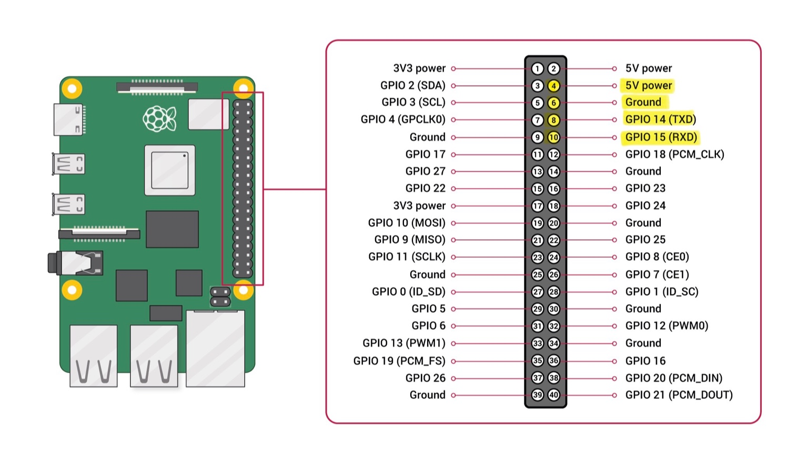

> ⚠️ **Disclaimer**
>  
> This repository is provided for **reference and educational purposes only**.  
> Configuration examples and parameter files are hardware- and use-case-specific.  
> Use at your own risk.

---

## Dependencies and Attribution

This guide relies on and builds upon the **MAVLink Anywhere** open-source project
for MAVLink forwarding and networking functionality.

- Project: https://github.com/mavlink-anywhere/mavlink-anywhere
- All original code and concepts remain the property of their respective authors
  and are used in accordance with the project’s licence.

This repository focuses on **system integration, configuration, and validation**
rather than original software development.

---

# BVLOS UAS Mavlink telemetry & video to GCS (Cellular)
Practical guide and reference material for delivering live video and MAVLink telemetry from a BVLOS UAS to a Ground Control Station (GCS) over a cellular data connection. Includes Single Board Computer (SBC) integration (Raspberry Pi Zero 2 W) and use of an overlay VPN (NetBird) for secure connectivity.

---
## Document Information

- **Date:** 22/12/2025
- **Title:** BVLOS_MavLink_Netbird_Gstm_Setup
- **Document Version:** V3

---
## Hardware
- Raspberry Pi Zero 2 WH

---
## Linux Operating System: Raspberry Pi OS

- **Distributor:** Debian  
- **Description:** Debian GNU/Linux 12 (bookworm)  
- **Release:** 12  
- **Codename:** bookworm

**Raspberry Pi OS Image:**  
https://downloads.raspberrypi.org/raspios_arm64/images/raspios_arm64-2023-12-06/2023-12-05-raspios-bookworm-arm64.img.xz

---
## Software

- **Netbird**  
  https://app.netbird.io/install  (Windows)(Linux)

- **Mavlink-Anywhere**  
  https://github.com/alireza787b/mavlink-anywhere  (Linux)

- **MissionPlanner**  
  https://firmware.ardupilot.org/Tools/MissionPlanner/MissionPlanner-latest.msi  (Windows)

- **QGroundControl**  
  https://d176tv9ibo4jno.cloudfront.net/latest/QGroundControl-installer.exe  (Windows)

- **MobaXterm**  
  https://mobaxterm.mobatek.net/download-home-edition.html  (Windows)

- **Raspberry Pi Imager**  
  https://www.raspberrypi.com/software/  (Windows)

- **VScode**  
  https://code.visualstudio.com/download  (Windows)

---
## User Account Details

- **Hostname:**
	- `server` (if asked)
- **User names:**
  - `Linux1` (Group_1)
  - `Linux2` (Group_2)
  - `Linux3` (Group_3)
  - `Linux4` (Group_4)
  - `Linux5` (Group_5)
  - `Linux6` (Group_6)
- **Password:**
	- `password`  
- **SSH enabled:**
	- `YES`

---


# Step 1: Installing Raspberry Pi OS 
## Flash SD card
1. Download Raspberry Pi iOS from the link above if using a Non RPi SBC arm64.
2. For the RPi Zero 2 WH use **Raspberry Pi Imager** to write the OS to the SD card.
   - Choose RPi Zero 2 WH 
   - Choose Raspberry Pi OS (other)
   - Choose Raspberry Pi OS (Legacy, 64-bit)
     - It should show "A port of Debian Bookworm with security updates and desktop inviroment" 
   - Proceed with the Customisation and writing of the OS
  
## Initial desktop Setup
3. Insert the flashed SD card into the Raspberry Pi and boot normally with:
   - HDMI & display
   - Keyboard and mouse
4. During first boot:
   - Connect keyboard and mouse via Bluetooth
   - Create a user (if asked)
   - Connect to Wi‑Fi (if asked)
5. **Do NOT run system updates if prompted.**
6. From the desktop:
   - Open **Menu (top left)** → **Peferences** → **Raspberry Pi Configurator**

### Interfaces Tab
- Enable **`SSH`** Toggle
- Enable **`Serial Port`** Toggle
- Disable **`Serial Console`** Toggle

### System Tab
> **WARNING Before continuing:** write down the RPi’s IP address (hover over the Wi‑Fi icon in the top‑right corner).

- Enable **`To CLI`** Toggle
- Enable **`Console Auto Login`** Toggle

7. Reboot when prompted.

## Remote access RPi (SSH)

The system will now boot directly to the command line (no desktop). You can continue setup remotely using **MobaXterm** from another PC.

---

# Step 2: Installing Netbird & Mavlink-anywhere

---
## Disable Kernel & Bootloader Updates
```bash
sudo apt-mark hold raspberrypi-kernel raspberrypi-bootloader
```

---
## System Update
```bash
sudo apt update && sudo apt upgrade -y
```

---
## Install Netbird
```bash
sudo curl -fsSL https://pkgs.netbird.io/install.sh | sh
```

---
## Run Netbird
```bash
sudo netbird up
```
- Copy the generated link into a browser and log into your Netbird account to authenticate
#### Netbird web-admin panel
- Find the peer device you just autenticated
- Disable Session Expiration
- (Advanced option) Do NOT Enable **SSH access** 
- Note your **Netbird IP address** (example: `100.127.213.206`)


---
### (Optional-Advanced) Enable SSH on Netbird  
 - SSH will be managed by Netbird and the native SSH server needs to be disabled for this to work
```bash
sudo netbird down
```
```bash
sudo netbird up --allow-server-ssh --enable-ssh-root
```
---

## Download Mavlink-Anywhere
```bash
git clone https://github.com/alireza787b/mavlink-anywhere.git
cd mavlink-anywhere
```

## Run Installation Script
```bash
chmod +x install_mavlink_router.sh
sudo ./install_mavlink_router.sh
```


## Run Configuration Script
```bash
chmod +x configure_mavlink_router.sh
sudo ./configure_mavlink_router.sh
```

**Configuration prompts:**
- UART Device: `/dev/ttyS0` default  (press ENTER)
- Baud Rate: `57600` default  (press ENTER)
- GCS Port: `14550` default
- UDP Endpoints: Enter Netbird(s) IP of the GCS
  - Example 1: Single GCS	`<Netbird-GCS-IP>`:14550	
  - Example 2: Multiple GCS	`<Netbird-GCS_1-IP>`:14550 `<Netbird-GCS_2-IP>`:14550
  
- Replace `<Netbird-GCS-IP>`


---
### (Optional) Service Checks 
```bash
sudo systemctl status mavlink-router
```

### (Optional) Live Logs 
```bash
sudo journalctl -u mavlink-router -f
```

### (Optional) Configuration File Location 
```bash
sudo nano /etc/mavlink-router/main.conf
```

---
## Return to Home Directory
```bash
cd ~
```


## Raspberry Pi MAVLink UART Wiring

After installing and configuring MAVLink on the Raspberry Pi, connect the
flight controller's UART pins to the Raspberry Pi GPIO pins.



**Wiring notes:**
- Use a **5V-tolerant UART** on the flight controller
- **TX ↔ RX must be crossed** (FC TX → RPi RX, FC RX → RPi TX)
- **Ground must be common** between the flight controller and the Raspberry Pi
- Power the Raspberry Pi only from a **regulated 5V source**

This UART link is used solely for MAVLink communication between the
flight controller and the companion computer.


---
# Step 3: Installing Gstreamer & configuring video stream to GCS
## Network Information (Examples)
### Raspberry Pi Zero 2 WH (onboard UAS)

- Local IP: (Example`192.168.5.34`)  	
- Netbird IP: (Example`100.127.55.72`)	

### Ground Control Station (Mission Planner / QGroundControl)

- Local IP: (Example`192.168.5.75`)	
- Netbird IP: (Example`100.127.150.223`)


---
# Method 1: (Preferred)
#### RTSP streaming using GStreamer RTSP Server (Python)

## Install GStreamer & dependencies 
```bash
sudo apt update
sudo apt install -y \
  libcamera-apps \
  gstreamer1.0-libcamera \
  gstreamer1.0-tools \
  gstreamer1.0-plugins-base \
  gstreamer1.0-plugins-good \
  gstreamer1.0-plugins-bad \
  gstreamer1.0-plugins-ugly \
  gir1.2-gstreamer-1.0 \
  gir1.2-gst-rtsp-server-1.0 \
  python3-gi \
  speedtest-cli
```

---
## Create RTSP Server Script
```bash
nano gcsstream_rtsp.py
```
**Paste** the following, then **`CTRL+X → Y → ENTER`** to Save and Exit:

```python
#!/usr/bin/env python3

import gi
gi.require_version('Gst', '1.0')
gi.require_version('GstRtspServer', '1.0')

from gi.repository import Gst, GstRtspServer, GLib

Gst.init(None)

server = GstRtspServer.RTSPServer()
server.set_service("8554")
server.set_address("0.0.0.0")

factory = GstRtspServer.RTSPMediaFactory()
factory.set_launch(
    '( libcamerasrc ! video/x-raw,width=1280,height=720,framerate=20/1 '
    '! videoconvert '
    '! x264enc tune=zerolatency speed-preset=ultrafast bitrate=2000 key-int-max=20 '
    '! h264parse '
    '! rtph264pay name=pay0 pt=96 )'
)

factory.set_shared(True)

mounts = server.get_mount_points()
mounts.add_factory("/stream", factory)

server.attach(None)

print(" ")
print("QGroundControl RTSP Source URL:")
print(" ")
print("rtsp://<Netbird-RPi-IP>:8554/stream")
print(" ")
print(" ")
print("MissionPlanner Gstreamer Sourcse URL:")
print(" ")
print(
    "rtspsrc location=rtsp://<Netbird-RPi-IP>:8554/stream latency=0 "
    "! rtph264depay ! avdec_h264 ! videoconvert "
    "! video/x-raw,format=BGRA ! appsink name=outsink"
)

GLib.MainLoop().run()
```
- (Optional) Replace `<Netbird-RPi-IP>` with your Netbird IP for the Rpi
---
## Make Script Executable & Run

```bash
chmod +x gcsstream_rtsp.py
python3 gcsstream_rtsp.py
```

#### Confirm video feed on QGroundControl & Mission Planner below
- To cancel the process after confirming the video feed press: **`CTRL+C`**  

---
### QGroundControl Video Settings

- Source: **RTSP**  
- URL:

```
rtsp://<Netbird-RPi-IP>:8554/stream
```

- Replace `<Netbird-RPi-IP>` with your Netbird IP for the Rpi

- GQC does not allow the camera to be flipped in software as it does on MissionPlanner


#### Testbench performance on Rpi Zero 2WH `40% CPU , 0.19GB Ram , 2.5Mb/s Upload , 1.15s latency`


---
### Mission Planner Video Settings

- Source: **Gstreamer**  
- URL:

```
rtspsrc location=rtsp://<Netbird-RPi-IP>:8554/stream latency=0 ! rtph264depay ! avdec_h264 ! videoconvert ! video/x-raw,format=BGRA ! appsink name=outsink
```

#### To flip the camera 
```
rtspsrc location=rtsp://<Netbird-RPi-IP>:8554/stream latency=0 ! rtph264depay ! avdec_h264 ! videoflip method=rotate-180 ! videoconvert ! video/x-raw,format=BGRA ! appsink name=outsink
```
- Replace `<Netbird-RPi-IP>` with your Netbird IP for the Rpi

#### Testbench performance on Rpi Zero 2WH `40% CPU , 0.19GB Ram , 2.5Mb/s Upload , 1.15s latency`

---
## Run RTSP Stream on Boot (systemd)
```bash
sudo nano /etc/systemd/system/gcsstream-rtsp.service
```
**Paste** the following, then **`CTRL+X → Y → ENTER`** to Save and Exit:
```ini
[Unit]
Description=GCS RTSP Video Stream (GStreamer)
Wants=network-online.target
After=network-online.target

[Service]
Type=simple
User=linux
WorkingDirectory=/home/linux
ExecStart=/usr/bin/python3 /home/linux/gcsstream_rtsp.py
Restart=on-failure
RestartSec=3

[Install]
WantedBy=multi-user.target
```


## Enable Service

```bash
sudo systemctl daemon-reload
sudo systemctl start gcsstream-rtsp
sudo systemctl enable gcsstream-rtsp
```
### (Optional) Check service status 

```bash
sudo systemctl status gcsstream-rtsp
```


### (Optional) Stop & Disable 

```bash
sudo systemctl stop gcsstream-rtsp
sudo systemctl disable gcsstream-rtsp
```

---

# Method 2: (Fallback)

**Push streaming to GCS using rpicam-vid OR Gstreamer**

### Option 1: (rpicam-vid) - Mission Planner Only

```bash
rpicam-vid -t 0 --nopreview --width 1280 --height 720 --framerate 20 \
--codec h264 --bitrate 2000000 --inline --profile baseline -o - | \
gst-launch-1.0 fdsrc ! h264parse config-interval=1 ! \
rtph264pay pt=96 config-interval=1 ! \
udpsink host=<Netbird-GCS-IP> port=5600 sync=false
```
- Replace `<Netbird-GCS-IP>` with your Netbird IP for the GCS
#### Confirm video feed on Mission Planner (should just appear as its being pushed)
- To cancel the process after confirming the video feed press: **`CTRL+C`** 
#### Testbench performance on Rpi Zero 2WH `9% CPU , 0.21GB Ram , 4.5Mb/s Upload , 0.5s latency`

---

### Option 2: (Gstreamer) - Mission Planner Only

```bash
gst-launch-1.0 -v libcamerasrc ! \
video/x-raw,width=1280,height=720,framerate=20/1 ! \
videoconvert ! \
x264enc tune=zerolatency speed-preset=ultrafast bitrate=2000 key-int-max=20 ! \
h264parse config-interval=1 ! \
rtph264pay pt=96 ! \
udpsink host=<Netbird-GCS-IP> port=5600
```
- Replace `<Netbird-GCS-IP>` with your Netbird IP for the GCS 

#### Confirm video feed on VLCMission Planner (should just appear as its being pushed)
- To cancel the process after confirming the video feed press: **`CTRL+C`** 
#### Testbench performance on Rpi Zero 2WH `39% CPU , 0.18GB Ram , 2,5Mb/s Upload , 1s latency`

---

# Method 3: (Last Resort)

**TCP streaming to GCS using rpicam-vid**

### Option 1: (rpicam-vid) - VLC Only

```bash
rpicam-vid \
  --width 1280 \
  --height 720 \
  --framerate 20 \
  --codec h264 \
  --profile baseline \
  --inline \
  --listen \
  --nopreview \
  -o tcp://0.0.0.0:8888 \
  -t 0
```
#### Confirm video feed on VLC below
- To cancel the process after confirming the video feed press: **`CTRL+C`**  

**VLC URL:**
```
tcp/h264://<Netbird-RPi-IP>:8888
```
